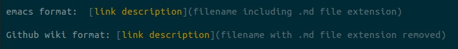

# convertLinksGithubWikiEmacs, a Python Utility

## problem to be solved

I was just putting my first project (`orgFixLinks`) up on Github, and wanted to
write a Github Wiki to explain it.  I wanted to write in `emacs` **on my local
machine rather than on Github.com**.  I
found <http://jblevins.org/projects/markdown-mode/> and thought I had everything
I would need.  I wrote the whole wiki in `emacs` and the local previews (C-c C-c v
Export and View) looked fine.  I uploaded the wiki to Github and **the links to
.md files were not working as intended**.  On clicking a link, Github would show
the raw file instead of showing something that looks like a web page.

I spent some time googling.  I emailed Github for help.  The best I could come
up with (by experimenting with a dummy repository in Github) is that **a link that
works in `emacs` is formatted differently than a link that works in a Github wiki**:

Now I had about 46 .md files to convert.  To work locally again, I would need to
convert back.

A related problem: I am not aware
if <http://jblevins.org/projects/markdown-mode/> **tests for broken links**.
Once a wiki gets larger, it would be nice to know if any links are broken before
uploading to Github.

## solution approach

The language I have been trying to learn is `python`, so I wrote a `python`
script that **converts all .md files in a chosen folder (but not in
subfolders)** so that the links inside are converted from either `emacs` format
to Github wiki format, or Github wiki format to `emacs` format.  This script
runs in the terminal (no GUI).

To convert links inside a file means the file is rewritten on disk.

Additionally, a log file is written.  **Warnings in the log file indicate which
links are broken**, if any.

A second `python` script uses the unittest module to attempt to verify that the
main script operates as intended.  By reading this script, a user can clearly
identify what the main script is attempting to do.  Not every feature is tested.

## Installation

### emacs installation

GNU Emacs 24.3.1 (x86_64-pc-linux-gnu, GTK+ Version 3.10.7)
 of 2014-03-07 on lamiak, modified by Debian

<http://jblevins.org/projects/markdown-mode/>

I got stuck at: M-x package-install RET markdown-mode RET.  Got unstuck by
googling the error message and finding: 

<http://emacs.stackexchange.com/questions/10831/tried-to-install-package-got-error-during-download-request-not-found>

Also, I found the .emacs setup by terdon in

<http://superuser.com/questions/552888/auto-load-gfm-mode>

to be useful.

### python installation
recommended but optional: set up a virtual environment (<http://docs.python-guide.org/en/latest/dev/virtualenvs/>)

Python 2.7.6

Python add-ons:

pudb (debugger)  not required, but useful; script has a flag to run it.

Output of `pip list` in my virtual environment:

backports.shutil-get-terminal-size (1.0.0)

cffi (1.6.0)

cryptography (1.3.2)

decorator (4.0.9)

enum34 (1.1.4)

idna (2.1)

ipaddress (1.0.16)

ipython (4.2.0)

ipython-genutils (0.1.0)

ndg-httpsclient (0.4.0)

pathlib2 (2.1.0)

pexpect (4.0.1)

pickleshare (0.7.2)

pip (8.1.2)

ptyprocess (0.5.1)

pudb (2016.1)

pyasn1 (0.1.9)

pycparser (2.14)

Pygments (2.1.3)

pyOpenSSL (16.0.0)

pysqlite (2.8.2)

requests (2.10.0)

setuptools (21.0.0)

simplegeneric (0.8.1)

six (1.10.0)

traitlets (4.2.1)

urwid (1.3.1)

## Usage

### using the main script convertLinksGithubWikiEmacs.py

In terminal, typing `python convertLinksGithubWikiEmacs.py -h` prints the usage message:

> use case: using emacs to work on .md files which are for a github wiki
> script rewrites all .md files in a local folder so that links to other .md files match a format.
> default is to change from emacs github flavored format (description)[filename.md] to github website format (description)[filename]
> 
> flags with no input argument:
> -h, --help: show this help blurb
> -e, --emacsLinks: convert .md files so that links to other .md files match emacs github flavored wiki format (add .md)
> -t, --testLinks: test if links are working; output goes in log file
> 
> flags with input argument:
> -f, --folder:  give the folder where there are .md files to be converted
> -L, --loggingLevel: do not log at or below.  None, debug, info, warning, error, or critical.
> 
> example call:
> python convertLinksGithubWikiEmacs.py -e -f /home/userName/Documents

To specify a default folder, please edit the main script.

## testing the main script

Run tests (`python` unit tests) by typing in terminal:
`python convertLinksGithubWikiEmacsTest.py`

## Contributing

Boilerplate from <https://gist.github.com/zenorocha/4526327>:

> 1. Fork it!
> 
> 2. Create your feature branch: `git checkout -b my-new-feature`
> 
> 3. Commit your changes: `git commit -am 'Add some feature'`
> 
> 4. Push to the branch: `git push origin my-new-feature`
> 
> 5. Submit a pull request :D

You can at least fork.  If I can comprehend your changes (far more likely
if verbosely documented), I am much more likely to accept a pull request.
Submissions must respect intellectual property rights of work they are
derived from (e.g. citing stackexchange).

I put this project on Github because it would make me happy if someone got use
from it.

## Credits

This is an **amateur** `python` script originally developed by the github user
cashTangoTangoCash.

Dive Into Python for a good detailed tutorial of the unittest module

If applicable, the script contains comments which credit sources of code
snippets found on e.g. <http://programmers.stackexchange.com/>.

## License

GNU General Public License v3.0

See: LICENSE.txt

